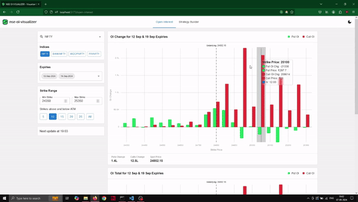

## NSE OI VISUALIZER & STRATEGY-BUILDER

A simple React application inspired by [Sensibull](https://www.sensibull.com/), that visualizes real-time Open Interest data and Option Strategy Profit and Loss (WIP) for Indian Benchmark Indices and F&O stocks. The app fetches data from NSE API to show OI bar plots and Strategy Payoff line plots. The data is auto-updated at 3-minute intervals, precisely at times when the minutes are divisible by 3. Frontend is made with React, Material UI, Redux and D3. Backend is made with NodeJS. (Note: The app is work in progress).

## Demo

## Features
1. Fetches Real-time Open Interest data of Indian Benchmark Indices (NIFTY, BANKNIFTY, FINNIFTY and MIDCPNIFTY) and F&O stocks listed on NSE (185 stocks).
2. Shows Change in Open Interest and Total Open Interest.
3. Has a multi expiry selector to see combined Open Interest. With 4 (2 weekly, 2 monthly) selectable expiries for indices and 2 (2 monthly) selectable expiries for stocks.
4. Has a Strike range selector to adjust the no. of strikes to be shown.
5. Shows Option Strategy Payoff (P&L) at a target date as well as the expiry date for the selected underlying (maximum 10 legs).
6. Uses Black-76 model to calculate IVs for each strike, and shows OTM option IV for both call and put.
7. All IVs are calculated based on a synthetic (implied) futures price, computed with put-call parity formula based on the ATM option for each expiry.
8. Auto-updates data, using a web worker, precisely at times when the minutes are divisible by 3 (ex: 9:30, 9:33, 9:36,...,9:57, 10:00 etc).
9. Caches data with RTK Query for a maximum of 3 minutes.
10. Charts have tooltips.
11. Local storage persistence of the selected underlying.

## How to run it locally
1. Clone the repository.
2. cd into backend directory and run `npm install` to install dependencies.
3. Run 'npm run dev' to start the proxy server.
4. cd into frontend directory and run `npm install` to install dependencies.
5. Run 'npm run dev' to start the frontend app.
6. Open http://localhost:5173/ in your browser.
7. You are good to go.

## To be done
1. Improved UI/UX.
2. Implement Error Boundaries and show appropriate error messages.
3. Add strategy presets.
4. FII and DII data visualization.

## Note
1. IV calculation and Option price calculation Black-Scholes code sourced from [dedwards25/Python_Option_Pricing](https://github.com/dedwards25/Python_Option_Pricing)
2. Minor differences in IVs and as a result in Option Payoffs as compared to Sensibull might be down to the fact that all the IVs are being calculated on synthetic futures prices, whereas Sensibull uses actual futures prices where available for monthly expiries. Another reason might be due to variations in time to expiry calculations.

## References
1. https://www.sensibull.com/ app.
2. https://sensibull.freshdesk.com/support/solutions/folders/43000300252 Sensibull explains the Math behind Option Pricing here.
3. https://2019.wattenberger.com/blog/react-and-d3 this is an insightful blog on how to use D3 with React, while keeping things Reacty.
4. https://www.nseindia.com/ data source.
