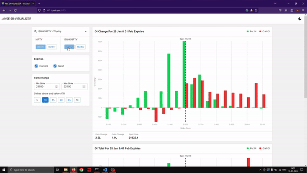

## NSE-OI-VISUALIZER
A simple React application inspired by [Sensibull](https://www.sensibull.com/), which visualizes real-time Open Interest data of Indian Benchmark Indices and F&O stocks. Data is fetched from NSE API routed through a proxy server and plots the data as bar charts. The app shows Change in Open Interest and Total Open Interest for the selected instrument. The data is auto-updated at 3-minute intervals, precisely at times when the minutes are divisible by 3. Frontend is made with React, Material UI, Redux and D3. Backend is made with NodeJS. (Note: The app is work in progress).

## Demo

## Features
1. Real-time Open Interest data of Indian Benchmark Indices and F&O stocks.
2. Shows Change in Open Interest and Total Open Interest.
3. Show current and next expiry data.
4. Strike range selector to adjust the no. of strikes to be shown.
5. Auto-update data, using a web worker, precisely at times when the minutes are divisible by 3 (ex: 9:30, 9:33, 9:36,...,9:57, 10:00 etc).
6. Charts have tooltips.
7. Local storage persistence of selected underlying.

## How to run it locally
1. Clone the repository.
2. cd into backend directory and run `npm install` to install dependencies.
3. Run 'npm run dev' to start the proxy api.
4. cd into frontend directory and run `npm install` to install dependencies.
5. Run 'npm run dev' to start the frontend app.
6. Open http://localhost:5173/ in your browser.
7. You are good to go.

## To be added
1. Timestamps showing last updated time.
2. FII and DII data visualization.
3. Option Payoff visualization? Maybe.

## References
1. https://www.sensibull.com/ tried to replicate the UI of this app.
1. https://2019.wattenberger.com/blog/react-and-d3 this is an insightful blog on how to use D3 with React, while keeping things Reacty.